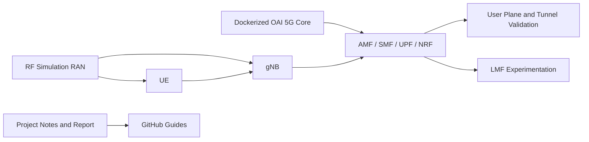

# Implementation and Analysis of 5G Core and RAN using OpenAirInterface

This repository packages a B.Tech. project focused on building and analyzing a software-based 5G testbed using OpenAirInterface (OAI), Dockerized CN5G deployment, RF simulation, and Location Management Function (LMF) experimentation.

## Suggested Repository Name

Recommended GitHub repository name:

`oai-5g-core-ran-analysis`

Other good options:

- `openairinterface-5g-testbed`
- `5g-core-ran-oai-project`
- `oai-rfsim-lmf-workflow`

## What this repository contains

- a documentation-first record of the project workflow
- setup notes for running OAI CN5G and RAN in `rfsim` mode
- the submitted final report and presentation assets
- cleaned guides derived from the attached notes and report

## Project scope

The project centers on:

1. deploying the OAI 5G Core in Docker
2. running the simulated gNB and UE with RF simulation
3. validating control-plane and data-plane behavior through logs and connectivity checks
4. studying LMF integration in the OAI ecosystem
5. documenting PlutoSDR limitations and the future USRP-based path

## System Overview



## Repository layout

```text
BTP2/
├── docs/
│   ├── assets/
│   │   ├── presentations/
│   │   └── reports/
│   ├── guides/
│   └── notes/
├── .gitattributes
├── .gitignore
├── CONTRIBUTING.md
├── INSTALL.md
├── PROJECT_STRUCTURE.md
└── README.md
```

## Main directories and files

- `docs/`
  Main project content. This is where the report assets, cleaned guides, and preserved raw notes live.

- `docs/assets/`
  Submitted academic artifacts such as the final report and presentations.

- `docs/guides/`
  The most useful folder for day-to-day understanding of the project. These Markdown files explain setup, architecture, reproducibility, LMF work, and PlutoSDR observations.

- `docs/notes/`
  Original setup notes kept for reference so the cleaned guides remain traceable.

- `INSTALL.md`
  The first technical file to open before reproducing the OAI workflow.

- `PROJECT_STRUCTURE.md`
  Compact directory map of the entire repository.

- `CONTRIBUTING.md`
  Editing and maintenance guidance for future cleanup.

## Start here

- project summary: [`docs/guides/project-summary.md`](docs/guides/project-summary.md)
- setup workflow: [`docs/guides/oai-rfsim-workflow.md`](docs/guides/oai-rfsim-workflow.md)
- prerequisites: [`INSTALL.md`](INSTALL.md)
- architecture notes: [`docs/guides/system-architecture.md`](docs/guides/system-architecture.md)
- reproducibility: [`docs/guides/reproducibility.md`](docs/guides/reproducibility.md)
- references and source links: [`docs/guides/references.md`](docs/guides/references.md)
- naming suggestion: [`docs/guides/repo-name-suggestions.md`](docs/guides/repo-name-suggestions.md)

## Key outcomes from the report

- software-based RF simulation with OAI CN5G and RAN was completed and analyzed
- LMF experimentation was explored in the Dockerized OAI environment
- PlutoSDR was investigated but did not become the final deployment path
- the report identifies USRP-backed deployment as the correct future hardware path

## Recommended Reading Order

1. [`docs/guides/project-summary.md`](docs/guides/project-summary.md)
2. [`INSTALL.md`](INSTALL.md)
3. [`docs/guides/oai-rfsim-workflow.md`](docs/guides/oai-rfsim-workflow.md)
4. [`docs/guides/lmf-experimentation.md`](docs/guides/lmf-experimentation.md)
5. [`docs/guides/plutosdr-notes.md`](docs/guides/plutosdr-notes.md)
6. [`docs/guides/references.md`](docs/guides/references.md)

## Included project assets

- [`docs/assets/reports/final_report.pdf`](docs/assets/reports/final_report.pdf)
- [`docs/assets/presentations/midsem_presentation.pptx`](docs/assets/presentations/midsem_presentation.pptx)
- [`docs/assets/presentations/endsem_presentation.pptx`](docs/assets/presentations/endsem_presentation.pptx)

## Important note

This repository is primarily a structured academic project archive and deployment guide. It does not currently include the full OAI source code itself; instead, it documents how to obtain and run the external OAI repositories required for the workflow.
